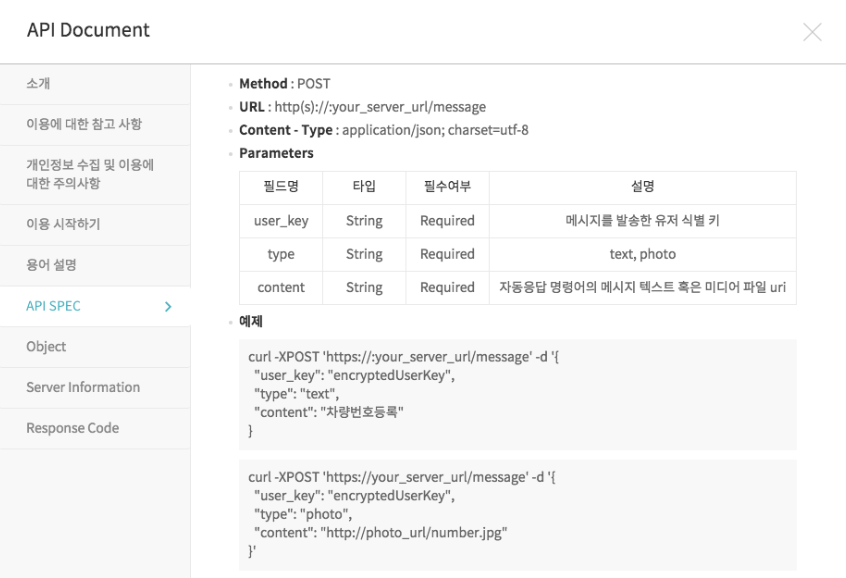

# 카카오톡 플러스 친구

### 0. 간단한 설명

- 지금까지 우리가 만들었던 레일즈 서버는 사용자가 URL을 통해서 요청이 들어오면 html문서를 응답해 주었습니다.

- 하지만 사용자가 아닌 서버가 요청을 할때는 데이터만 전송해주는게 효율적입니다. 그래서 우리는 JSON을 사용해서 서버가 요청한 데이터를 응답해줍니다.

- 지금까지 우리가 사용한 컨트롤러는 다음과 같습니다.

  ```ruby
  # GET /movies
  # GET /movies.json
  def index
    @movies = Movie.all
  end
  ```

- 그런데 여기 index안에 생략된 부분이 있습니다.

  > Rails에서는 '설정보다 규약(CoC: convention over configuration)'를 권장한다는 것을 들어보셨을 겁니다. 기본 출력 결과는 CoC의 좋은 예시이기도 합니다. Rails 컨트롤러는 기본적으로 라우팅에 맞는 이름을 가지는 뷰를 자동적으로 선택하고, 그것을 사용해서 결과를 출력합니다.
  >
  > ```
  > class BooksController < ApplicationController
  >   def index
  >     @books = Book.all
  >   end
  > end
  > ```
  >
  > 이 코드에서 주목해야하는 부분은 '설정보다 규약'이라는 원칙 덕분에 index 액션의 마지막 부분에서 명시적으로 랜더링을 지시할 필요가 없다는 점입니다. 여기에서의 원칙은 '컨트롤러의 액션의 마지막 부분에서 명시적인 랜더링 지시가 없을 경우에는 컨트롤러가 사용가능한 뷰 목록의 경로로부터 `action명.html.erb`이라는 뷰 템플릿을 찾고, 그것을 사용할 것'입니다. 따라서, 이 경우에는 `app/views/books/index.html.erb`을 사용해서 출력합니다.

```ruby
def index
  @movies = Movie.all
  render "index.html.erb" # 너무 당연해서 Rails에서 생략 가능한 문장입니다.
end
```

- 기본으로 html문서를 응답하는 Rails를 JSON으로 응답시켜주기 위해서는 다음과 같이 적어주면 됩니다.

```ruby
def index
  @movies = Movie.all
  render json: @movies
end
```

##### 카카오톡 API 잘 모르면 [플러스 친구 자동응답 API](https://github.com/plusfriend/auto_reply)에 관한 API 문서 읽기


### 1. 설정하기

- [카카오톡 플러스친구 관리자 센터](https://center-pf.kakao.com/)로 들어가 카카오톡 아이디로 로그인을 해주세요.
- 새 플러스 친구를 만들어 주세요.
- [스마트채팅] - [API형] 설정


### 2. 서버를 만들어봅시다.

- 우리는 레일즈를 사용해서 카카오톡 API서버를 만들 예정입니다.

- 컨트롤러를 만들어 줍니다. `rails g controller kakao keyboard message`

- `app/controller/kakao_controller.rb` 위에서 실패했던 API테스트를 통과 하기 위해서 필수 조건인 키보드를 만들어 줍니다.

  ```ruby
  class KakaoController < ApplicationController
    def keyboard
      @keyboard = {
        :type => "buttons",						# 이렇게 작성해도
        buttons: ["선택 1", "선택 2", "선택 3"]		 # 요렇게 작성해도 똑같습니다.
      }
      render json: @keyboard
    end
  
    def message
    end
  end
  ```

- `config/routes.rb` 플러스친구 API는 URL요청이 정해져 있으므로 라우팅을 해줍니다.

  ```ruby
  # 기본으로 설정되있던 
  # get 'kakao/keyboard'를 다음과 같이 바꾸어 줍니다.
  get '/keyboard' => 'kakao#keyboard'
  ```

- 플러스 친구가 요구하는 최소한의 조건을 만족했으니 API테스트를 해보겠습니다. 테스트는 통과하였습니다. 추가적으로 인증을 마치고 저장을 합니다.

- 시작하기 버튼을 눌러 플러스친구 API형 채팅을 활성화 해봅시다. 안 누르면 keyboard가 생기지 않는다.

- 카카오톡에서 검색이 가능하려면 [관리] - [상세설정]에서 공개 설정을 활성화 합니다.

- 카카오톡에서 플러스친구 이름/아이디 로 검색을 해서 친구추가 되면서 키보드 확인 가능

  

### 3. 기능을 추가해 봅시다.

- 사용자가 보낸 메세지에 응답하기 위해서 API 문서를 읽어보겠습니다. `/message` 요청은 사용자가 선택한 명령어를 파트너사 서버로 전달하는 API입니다.



- `config/routes.rb` Method가 POST이기 때문에 라우팅을 해주겠습니다.

  ```
  # rails g 로 생성했던
  # get 'kakao/message'를 다음과 같이 바꿔줍니다.
  post '/message' => 'kakao#message'
  ```

- `app/controller/kakao_controller.rb` 사용자가 보낸 메세지는 content로 담겨서 넘어오기 때문에 다음과 같이 컨트롤러에서 받을 수 있습니다.

  ```ruby
  def message
    @user_msg = params[:content] # 사용자가 보낸 내용은 content에 담아서 전송됩니다.
  end
  ```

- `app/controller/application_controller.rb` CSRF 공격을 막기위한 부분을 주석처리 해줍니다.

  ```ruby
  class ApplicationController < ActionController::Base
    # Prevent CSRF attacks by raising an exception.
    # For APIs, you may want to use :null_session instead.
    protect_from_forgery with: :exception # 이 부분을 주석처리 해주세요
  end
  ```

- 응답을 하기 위한 기본 문장입니다. API문서를 읽어봅시다.

  ```ruby
  def message
    @user_msg = params[:content] # 사용자가 보낸 내용은 content에 담아서 전송됩니다.
    @msg = "기본응답입니다."
  
    # 메세지를 넣어봅시다.
    @message = {
      text: @msg
      }
  
    # 자주 사용할 키보드를 만들어 주겠습니다.
    @basic_keyboard = {
      :type => "buttons",						
      buttons: ["선택 1", "선택 2", "선택 3"]
      }
  
    # 응답
    @result = {
      message: @message,
      keyboard: @basic_keyboard
      }
    render json: @result
  end
  ```

- 사용자의 말을 그대로 다시 말해주는 메아리를 만들어봅시다.

  ```ruby
  class KakaoController < ApplicationController
    def keyboard
      @keyboard = {
        :type => "text"	# 키보드 형태를 버튼이 아닌 키보드로 설정합니다.
      }
      render json: @keyboard
    end
  
    def message
      @user_msg = params[:content] # 사용자가 보낸 내용은 content에 담아서 전송됩니다.
      @msg = @user_msg
      
      # 메세지를 넣어봅시다.
      @message = {
        text: @msg
      }
      
      # 자주 사용할 키보드를 만들어 주겠습니다.
      @basic_keyboard = {
        :type => "text"					
      }
      
      # 응답
      @result = {
        message: @message,
        keyboard: @basic_keyboard
      }
      render json: @result
    end
  end
  ```

- 몇가지 기능을 붙여보겠습니다. 메아리봇을 위한 키보드를 버튼형식으로 바꿔주세요. 추가할 세가지 기능은 **로또번호추천**, **점심메뉴추천**, **고양이사진** 입니다. 

  > gemfile에서 `gem 'rest-client'` `gem 'nokogiri'` 추가하기

  ##### app/controllers/kakao_controller.rb 수정

  ```ruby
  class KakaoController < ApplicationController
    def keyboard
      @keyboard = {
          :type => "buttons",
          :buttons => ["메뉴", "로또", "고양이"]
      }  
      render json: @keyboard
    end
    
    def message
      @user_msg = params[:content]
      @text = "기본응답"
      if @user_msg == "메뉴"
        @text = ["20층","멀캠식당","급식"].sample
      elsif @user_msg == "로또"
        @text = (1..45).to_a.sample(6).sort.to_s
      elsif @user_msg == "고양이"
        @url = "http://thecatapi.com/api/images/get?format=xml&type=jpg"
        @cat_xml = RestClient.get(@url)
        
        # http://www.nokogiri.org/tutorials/parsing_an_html_xml_document.html
        @cat_doc = Nokogiri::XML(@cat_xml)
        
        # http://www.nokogiri.org/tutorials/searching_a_xml_html_document.html
        @cat_url = @cat_doc.xpath("//url").text
        @photo = @cat_url     
      end
      
      @return_msg ={
        :text => @text
      }
      @return_msg_photo = {
        # 사진이 있을 때 사진이 함께 들어간 hash
        :photo => {
          :url => @cat_url,
          :width => 720,
          :height => 630
        }
      }
      
       @return_keyboard = {
          :type => "buttons",
          :buttons => ["메뉴", "로또", "고양이"]
      }
      
      if @user_msg == "고양이"
         @result = {
        :message => @return_msg_photo,
        :keyboard => @return_keyboard
      }
      else
        @result = {
        :message => @return_msg,
        :keyboard => @return_keyboard
      }
      end
      
      render json: @result
    end
  end
  ```

  

### 4. HEROKU Deploy

- 지금까지 만들었던 파일들을 헤로쿠에 올려봅시다. 

  ```bash
  # heroku에 로그인 하기
  ssol87:~/workspace (master) $ heroku login
  Enter your Heroku credentials:
  Email: dnghwls7@naver.com
  Password: **********
  Logged in as dnghwls7@naver.com
  ssol87:~/workspace (master) $ heroku create railsbot87
  Creating ⬢ railsbot87... done
  https://railsbot87.herokuapp.com/ | https://git.heroku.com/railsbot87.git
  ```

- 젬파일 수정을 해주세요 `Gemfile`

  ```ruby
  # 변경전
  #gem 'sqlite3'
  
  # 변경후
  gem 'sqlite3', :group => :development
  gem 'pg','~> 0.21.0', :group => :production
  gem 'rails_12factor', :group => :production
  
  # 만약 ruby version이 2.3.4이전 버전이라면 version을 명시해줘야 함
  ruby '2.3.4'
  ```

  > > $ bundle install
  >
  > heroku는 sqlite를 지원하지 않는다.

- 그리고 `/config/database.yml`파일도 수정을 해주세요

  ```ruby
  # 변경전 가장 마지막 부분
  # production:
  #   <<: *default
  #   database: db/production.sqlite3
  
  # 변경후  
  production:
    <<: *default
    adapter: postgresql
    encoding: unicode
  ```

- 다음의 순서대로 진행하면 됩니다.

  ```
  # git을 생성해서 파일을 올려줍니다.
  git init
  git add .
  git commit -m "kakao_bot"
  
  # 우리의 프로젝트를 헤로쿠에 디플로이 합니다.
  git push heroku master
  ```

  > heroku 주소 확인 https://railsbot87.herokuapp.com/keyboard
  >
  > 각자 나온 주소에서 keyboard를 뒤에 더 입력했을 때 json이 return 되면 일단 정상적으로 베포 된 것.
  
### 5. [친구 추가](https://github.com/plusfriend/auto_reply#53-%EC%B9%9C%EA%B5%AC-%EC%B6%94%EA%B0%80%EC%B0%A8%EB%8B%A8-%EC%95%8C%EB%A6%BC-api)

- model 생성

  ```bash
  $ rails g model user user_key:string chat_room:integer
  $ rake db:migrate
  ```
- `Routes.rb`

  ```ruby
  post '/friend' => 'kakao#friend_add'
  delete '/friend/:user_key' => 'kakao#friend_delete'
  ```

- model 수정

  ```ruby
  #app/models/user.rb
  class User < ActiveRecord::Base
      def plus
         self.chat_room += 1 
      end
  end
  ```

- controller 수정

  ```ruby
  # app/controllers/kakao_controller.rb
  ...
    def friend_add
      #친구 추가시 User 생성
      User.create(user_key: params[:user_key], chat_room: 0)
      render nothing: true #카카오에서 200만 응답 받는다고 하니까 자체적으로 보낼 것은 없음
    end
    
    def friend_delete
      #find methods는 id로 값을 찾지만 find_by는 column으로 찾을 수 있음
      User.find_by(user_key: params[:user_key]).destroy
    end
  ...
  ```